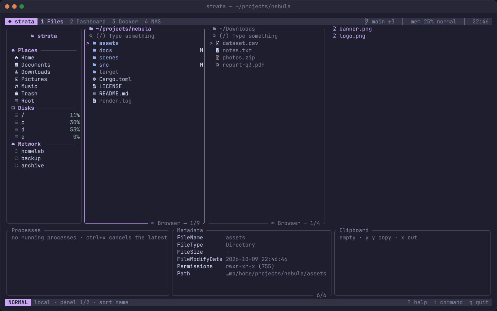

<p align="center">
  
</p>

<h1 align="center">strata</h1>

<p align="center">A fast, extensible terminal file explorer written in Rust.</p>



Everything you need, nothing you don't.

- **File operations**: copy, move, delete (to trash), rename, bulk rename in `$EDITOR`, duplicate, symlinks and hard links, `chmod`/`chown`, and undo for all of them
- **Trash browser**: restore, delete or empty, newest first
- **Compare and verify**: diff two files or directory trees, show checksums (MD5, SHA-1, SHA-256, SHA-512) and check downloads against a hash or `SHA256SUMS`
- **Archives**: browse zip and tar (gz, bz2, xz, zst) archives like directories and copy files out
- **Search**: filter, fuzzy find, and content search with ripgrep
- **Git status** markers next to every file, and **tabs** on top of multiple panels
- **Preview**: syntax-highlighted code, rendered Markdown, images, PDFs, video frames and cover art, Word/Excel/PowerPoint/OpenDocument/EPUB text, hex dumps, archives and directories; executable architecture and optional MD5/SHA-256 in the metadata pane
- **Multiple panels**: browse several directories side by side and copy between them with one key
- **NAS connections**: SMB, NFS and SFTP, with live reachability checks, a step-by-step connection test and passwords in your system keychain
- **Docker**: list, start, stop and inspect containers, and browse their filesystems
- **Dashboard**: disk free space, disk usage, I/O (IOPS, throughput, latency) and memory pressure (PSI)
- **27 themes**: Catppuccin, Nord, Tokyo Night, Dracula, Gruvbox, Rose Pine and more, plus your own
- **Lua plugins**: add keys, commands, panels, status-line segments and previewers
- **Vim-style keys**, all remappable

## Install

```sh
git clone https://github.com/HilthonTT/strata && cd strata
make install            # installs to ~/.local/bin
```

You need Rust 1.95 or newer. On Linux and macOS you also need OpenSSL headers for SFTP (`libssl-dev` on Debian/Ubuntu). Icons need a [Nerd Font](https://www.nerdfonts.com); set `icons = false` if you don't use one.

## Usage

```sh
strata [DIR...]           # one panel per directory
```

| Key | Action | Key | Action |
| --- | --- | --- | --- |
| `h j k l` | navigate | `space` / `v` | mark / visual select |
| `y y` `x` `p` | copy, cut, paste | `c` / `m` | copy / move to the next panel |
| `d d` / `D` | trash / delete | `r` / `R` | rename / bulk rename |
| `a` / `A` | new file / directory | `/` / `f` | filter / fuzzy find |
| `tab` / `n` | next / new panel | `1`–`4` | files, dashboard, Docker, NAS |
| `T` | theme picker | `:` | command palette |
| `u` / `ctrl+r` | undo / redo | `ctrl+g` | search file contents |
| `alt+j` / `alt+k` | scroll the preview | `alt+/` | search the preview |
| `t` | new tab | `g t` | next tab |
| `s` | sort menu | `E` | open the directory in your editor |
| `Y` / `=` | duplicate / permissions | `C` / `#` | compare / checksums |
| `U` | browse the trash | `g l` | paste as symlink |
| `y d` | copy the current directory's path | `Q` | quit and `cd` your shell there |
| `?` | all keys | `q` | quit |

Prefer superfile's keys (`ctrl+c`, `ctrl+x`, `ctrl+v`, `ctrl+d`…)? Set `keymap = "default"` under `[general]`.

To let `Q` change your shell's directory, add the wrapper to your shell config:

```sh
eval "$(strata --shell-init bash)"     # ~/.bashrc  (zsh: --shell-init zsh in ~/.zshrc)
strata --shell-init fish | source       # ~/.config/fish/config.fish
Invoke-Expression (& strata --shell-init powershell | Out-String)   # $PROFILE
```

## Configuration

Run `strata --dump-config > ~/.config/strata/config.toml` to start from a documented config. In it you can set the theme and key preset, remap keys, choose programs per file type (`[open_with]`), enable plugins and add NAS connections. To make a custom theme, add a `.toml` file in `~/.config/strata/themes/`.

## Plugins

Plugins are Lua files in `~/.config/strata/plugins/`. strata ships four official ones: `git`, `bookmarks`, `archive` and `zoxide`. See [docs/plugins.md](docs/plugins.md) for the API.

## Documentation

Full docs, screenshots and GIFs live in [`website/`](website), a Next.js site deployed to GitHub Pages. Run `make website-dev` to preview it locally.

## Development

```sh
make check    # fmt, clippy, tests (what CI runs)
make run
```

The code is a Cargo workspace:

| Crate | Purpose |
| --- | --- |
| `strata-core` | filesystem backends (local, SFTP, Docker), file operations, undo, jobs, search, git, NAS, keychain |
| `strata-sys` | disks, I/O, memory pressure, disk usage, Docker CLI |
| `strata-config` | config file, keymap, themes |
| `strata-plugin` | Lua plugin host |
| `strata` | the TUI |
| `xtask` | dev tasks: `cargo xtask media` records the docs screenshots and GIFs |

## License

MIT
